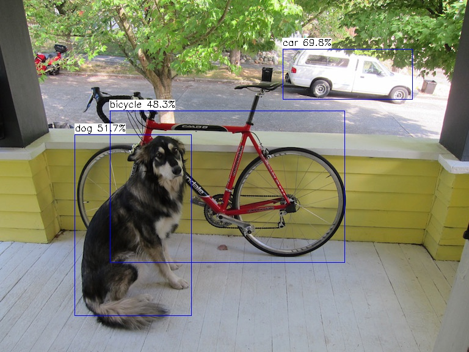

<h1 align="center">ZYNQ-NVDLA</h1>

NVDLA Xilinx FPGA Mapping！

1. [Technical Post](https://zhuanlan.zhihu.com/p/378202360)

2. **[Tengine Frontend Supported !](https://github.com/OAID/Tengine)**

## File Tree of WorkSpace

```
IP/ Vivado IP Package For Nvdla Small
include/ Tengine backend include
RTL/ nvdla small rtl (include wrapper.v)
kmd/ kernel mode drive for petalinux (include zynq7000 / zynq MPSoc)
paper/ Latex paper for Bachelor degree
prebuilt/ aarch64 prebuilt lib
reports/ Timing、Power、Resource、Execution reports
sdk_sanity/ sdk sanity Test for NVDLA
umd/ Compiler and Runtime source code
```

## Talk

- Tengine Open Talk : New Backend OpenDLA. [[slides](https://github.com/LeiWang1999/ZYNQ-NVDLA/TengineTalk.pdf)] [[recording](https://www.bilibili.com/video/BV1z44y1478k)]

## Test

#### 3.1 Classification

**Resnet18-Cifar10**

```bash
$ cd <tengine-lite-root-dir>/build
$ cmake --build . --target tm_classification_opendla
$ cd examples
$ ./tm_classification_opendla -m /root/Tengine/models/resnet18-cifar10-nosoftmax-relu_int8.tmfile -i /root/Tengine/images/cat.jpg -g 32,32 -s 1,1,1
Mean value not specified, use default   104.0, 116.7, 122.7
tengine-lite library version: 1.4-dev
NVDLA time: 0.012502 seconds

model file : /root/Tengine/models/resnet18-cifar10-nosoftmax-relu_int8.tmfile
image file : /root/Tengine/images/cat.jpg
img_h, img_w, scale[3], mean[3] : 32 32 , 1.000 1.000 1.000, 104.0 116.7 122.7
Repeat 1 times, thread 1, avg time 12.62 ms, max_time 12.62 ms, min_time 12.62 ms
--------------------------------------
10.087049, 3
3.833079, 2
3.026115, 5
2.420892, 4
-0.403482, 0
--------------------------------------
```

#### 3.2 Detection

**Yolox-nano**

```bash
$ cd <tengine-lite-root-dir>/build
$ cmake --build . --target tm_classification_opendla tm_yolox_opendla
$ cd examples
$ ./tm_yolox_opendla -m /root/Tengine/models/yolox_nano_relu_int8.tmfile -i /root/Tengine/images/dog.jpg -r 1
tengine-lite library version: 1.4-dev
Repeat 1 times, thread 1, avg time 1138.80 ms, max_time 1138.80 ms, min_time 1138.80 ms
--------------------------------------
detection num: 3
 2:  70%, [ 463,   80,  676,  163], car
16:  52%, [ 122,  220,  315,  517], dog
 1:  48%, [ 180,  181,  564,  430], bicycle
```

Output:


